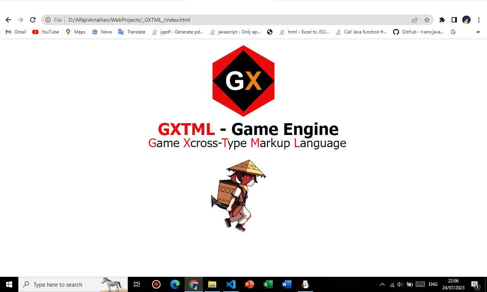

# </img> GXTML 
## Game Cross-Type Markup Language
HTML DOM-Based Lightweight Game Library, it's not using `<canvas></canvas>` <br>
but actually it's just manipulate DOM-Object `<div>` with CSS `transformation`

[]()
[]()
[]()
[]()



# Get Started
Create your simple own game with **GXTML** and there's no need `<canvas>` again <br>
bring your game to window on your web. Now lets goo :v <br>
```javascript
  GXTML.create({
      // Add game object
      box: GXTML.rect(0,0,100,100,'red'),

      // Initialize or load game
      setup(G){
          G.box.border = 'black';
      },
      // While game update frame
      update(G){
          G.box.move(1, 0);
      }
  });
```

# Play Animation
Interactive object with **Sprite** and **Animation** on your game? <br>
don't worry about it. We have that features! Here we go...
```javascript
    update(G){
        if(G.player.isRun)
          // $ dollar's mean an index-number like [0,1,2,3] of each .png files
          G.player.anim("assets/RUN/$.png", 3, 2);
    }
```

# Collision Detect
How we build a game without collision? We a have a **Collision**! <br>
but now (v0.1.0) don't support fully collision features :'v like Box2D
```javascript
    update(G){
        if(G.player.collide(G.enemy))
          // Detect when player collided with enemy
          G.gameOver();
    }
```

# Experimental Version
Thanks for you who have try this **Experimental Project** version of (v0.1.0) <br>
we hopes that you have interested with this library and want to contribute!

### see you next release (>w<) ~ equneko
